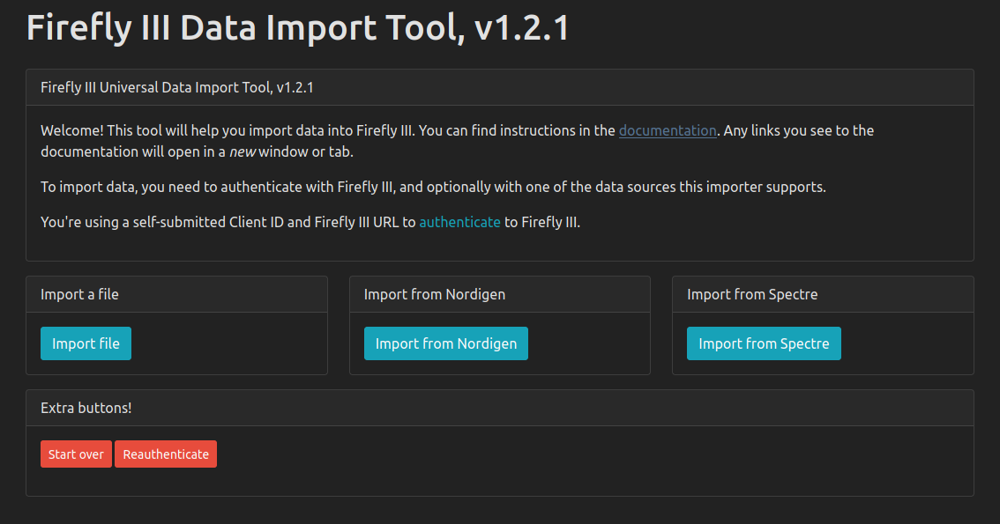

<!--
NOTA: Este README foi creado automáticamente por <https://github.com/YunoHost/apps/tree/master/tools/readme_generator>
NON debe editarse manualmente.
-->

# Firefly III Importer para YunoHost

[](https://ci-apps.yunohost.org/ci/apps/firefly-iii-di/)  

[](https://install-app.yunohost.org/?app=firefly-iii-di)

*[Le este README en outros idiomas.](./ALL_README.md)*

> *Este paquete permíteche instalar Firefly III Importer de xeito rápido e doado nun servidor YunoHost.*  
> *Se non usas YunoHost, le a [documentación](https://yunohost.org/install) para saber como instalalo.*

## Vista xeral

Firefly III Data Importer is the nr. 1 tool to import data into [Firefly III](https://www.firefly-iii.org/). This tools helps you import transactions from files or bank APIs into your
Firefly-III server. Please follow the documentation at https://docs.firefly-iii.org/data-importer/.

If your Firefly-III server is installed as a YunoHost app, please note:

- It should be accessible to all visitors (using its internal user management instead of YunoHosts') for the Data Importer to communicate with it.

- When configuring the Data Importer, use the public Firefly-III domain and path, not *localhost*, even if both services are on the same machine.


**Versión proporcionada:** 1.5.4~ynh1

## Capturas de pantalla



## Documentación e recursos

- Web oficial da app: <https://docs.firefly-iii.org/data-importer/>
- Documentación oficial para admin: <https://docs.firefly-iii.org/data-importer/how-to-use/>
- Repositorio de orixe do código: <https://github.com/firefly-iii/data-importer>
- Tenda YunoHost: <https://apps.yunohost.org/app/firefly-iii-di>
- Informar dun problema: <https://github.com/YunoHost-Apps/firefly-iii-di_ynh/issues>

## Info de desenvolvemento

Envía a túa colaboración á [rama `testing`](https://github.com/YunoHost-Apps/firefly-iii-di_ynh/tree/testing).

Para probar a rama `testing`, procede deste xeito:

```bash
sudo yunohost app install https://github.com/YunoHost-Apps/firefly-iii-di_ynh/tree/testing --debug
ou
sudo yunohost app upgrade firefly-iii-di -u https://github.com/YunoHost-Apps/firefly-iii-di_ynh/tree/testing --debug
```

**Máis info sobre o empaquetado da app:** <https://yunohost.org/packaging_apps>
